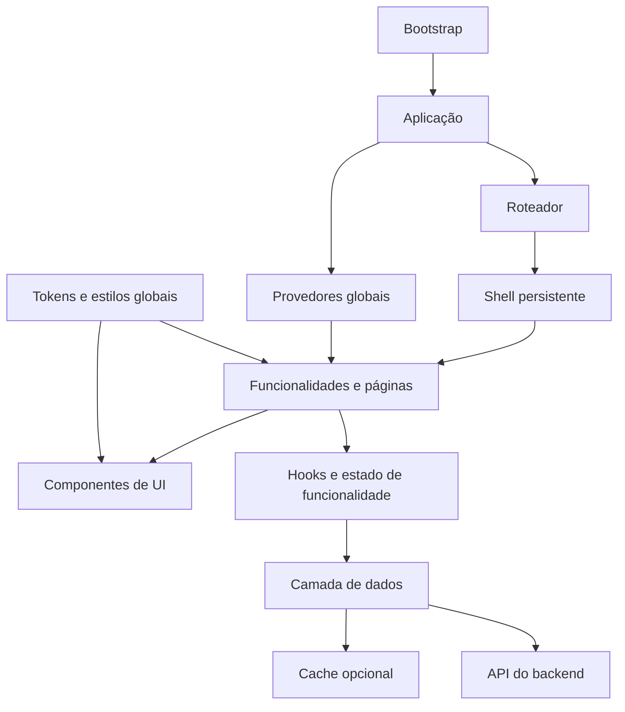
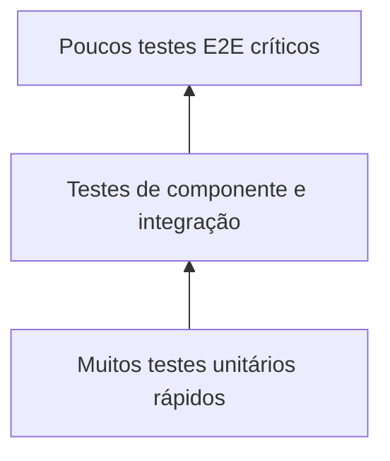

# Base de conhecimento: arquitetura de frontend para aplicações web

> Referência agnóstica para projetar, implementar, testar e operar interfaces web de produto. As tecnologias citadas são exemplos substituíveis; os princípios e limites arquiteturais são o conteúdo principal.

**Idioma do documento:** português  
**Escopo:** aplicações web de página única (SPA) ou equivalentes  
**Última revisão:** 6 de agosto de 2026  
**Status:** referência reutilizável

## 1. Objetivo

Este documento descreve uma arquitetura de frontend adequada a aplicações de trabalho com navegação interna, autenticação, consumo de APIs, formulários, operações assíncronas, conteúdo rico e requisitos de acessibilidade.

A proposta busca:

- separar infraestrutura, estado, domínio e apresentação;
- manter contratos explícitos entre frontend e backend;
- permitir evolução por funcionalidade sem criar dependências circulares;
- oferecer resposta visual imediata sem esconder falhas;
- tornar acessibilidade, segurança, desempenho e testes parte da implementação;
- manter o frontend implantável na raiz ou em um subcaminho;
- evitar que uma biblioteca específica se torne a arquitetura.

## 2. Princípios fundamentais

### 2.1 Arquitetura orientada a responsabilidades

Cada módulo deve ter um motivo principal para mudar:

- **entrada da aplicação:** inicialização e montagem;
- **composição:** roteamento, provedores globais e shell visual;
- **funcionalidades:** regras e jornadas de cada área do produto;
- **dados:** transporte HTTP, contratos, cache e persistência local;
- **UI compartilhada:** componentes reutilizáveis e acessíveis;
- **estilos:** tokens, temas e regras globais;
- **testes:** comportamento, integração e jornadas críticas.

### 2.2 Dependências apontam para limites estáveis

Uma página pode depender de componentes de UI, hooks de estado e funções da camada de dados. O sentido inverso deve ser evitado: a camada de dados não deve conhecer páginas, e componentes genéricos não devem conhecer regras de uma funcionalidade.

### 2.3 Contratos antes de detalhes visuais

Estruturas vindas da API, estados de operação e eventos de interação devem ser tipados. A interface visual é uma projeção desses contratos, não o local em que formatos externos são inferidos informalmente.

### 2.4 Estado mínimo e com proprietário definido

Todo estado deve ter um proprietário claro:

- estado efêmero fica no componente;
- estado de uma funcionalidade fica no módulo da funcionalidade;
- estado compartilhado fica em um provedor de escopo adequado;
- estado remoto continua sendo tratado como estado remoto;
- estado persistido deve ter política de validade e invalidação.

### 2.5 Melhorias de experiência não podem comprometer correção

Cache, prefetch e atualização otimista são otimizações. Falhas nessas otimizações não devem impedir o fluxo principal, e dados antigos nunca devem ser apresentados como atuais sem uma política explícita.

## 3. Arquitetura de referência



### 3.1 Fluxo recomendado

1. O bootstrap executa pré-requisitos indispensáveis, como processar um retorno de autenticação.
2. A aplicação monta o roteador e os provedores globais.
3. O roteador seleciona uma página dentro de um shell persistente.
4. A página coordena componentes, estado local e ações de negócio.
5. Hooks ou contextos chamam uma fronteira de dados centralizada.
6. A fronteira de dados aplica URL-base, autenticação, cabeçalhos e tratamento uniforme de erros.
7. A resposta tipada atualiza o estado remoto ou o cache.
8. A UI representa explicitamente carga, sucesso, vazio, atualização e erro.

## 4. Estrutura de pastas

Uma organização por funcionalidade reduz dispersão e facilita excluir, testar ou evoluir uma área do produto.

```text
src/
├── main.tsx                 # bootstrap e montagem
├── App.tsx                  # composição de rotas e provedores
├── components/
│   ├── layout/              # shell, navegação, barras e painéis
│   └── ui/                  # primitivas reutilizáveis
├── data/
│   ├── api.ts               # fronteira HTTP
│   ├── contracts.ts         # tipos de entrada e saída
│   ├── cache.ts             # persistência e validade
│   └── useApiData.ts        # integração reativa com dados remotos
├── features/
│   ├── auth/
│   ├── theme/
│   └── nome-da-funcionalidade/
│       ├── NomePage.tsx
│       ├── components/
│       ├── hooks/
│       └── NomePage.test.tsx
├── styles/
│   └── index.css            # tokens, base e regras globais
└── test/
    └── setup.ts
```

### Regras de organização

- Coloque código junto de quem o utiliza até existir reutilização real.
- Promova algo para `components/ui` somente quando houver um contrato genérico estável.
- Evite pastas globais genéricas como `utils` sem uma responsabilidade definida.
- Não importe internamente uma funcionalidade inteira por outra; extraia o contrato compartilhado para uma camada neutra.
- Mantenha testes próximos da unidade ou jornada que protegem.

## 5. Linguagens e sistema de tipos

### 5.1 Papéis das linguagens

| Papel | Escolha de referência | Princípio transferível |
|---|---|---|
| Lógica da aplicação | TypeScript | tipagem estática, contratos explícitos e análise antes do deploy |
| Estrutura visual | JSX/TSX sobre HTML semântico | componentes declarativos sem abandonar semântica nativa |
| Apresentação | CSS com utilitários e propriedades customizadas | tokens centralizados, composição local e temas desacoplados |
| Configuração | módulos JavaScript/TypeScript e JSON | configuração versionada e reproduzível |
| Testes | mesma linguagem da aplicação | menor distância entre implementação e validação |

Outros frameworks ou linguagens são adequados se preservarem essas propriedades.

### 5.2 Regras de tipagem

- Ative checagem estrita e falhe o build quando houver erro de tipo.
- Proíba variáveis e parâmetros não utilizados.
- Prefira uniões discriminadas para estados e mensagens heterogêneas.
- Use `unknown` na fronteira de erros ou dados não confiáveis; refine antes de acessar.
- Evite `any`, coerções amplas e asserções não justificadas.
- Modele identificadores e estados com tipos finitos quando o domínio permitir.
- Mantenha os contratos da API em um único local ou gere-os a partir de uma especificação.
- Valide em tempo de execução dados externos relevantes; tipos estáticos não validam JSON recebido.

Exemplo de estado explícito:

```ts
type RemoteState<T> =
  | { status: "idle" }
  | { status: "loading" }
  | { status: "success"; data: T; revalidating: boolean }
  | { status: "empty" }
  | { status: "error"; message: string };
```

Exemplo de conteúdo extensível:

```ts
type ContentBlock =
  | { type: "text"; content: string }
  | { type: "markdown"; content: string }
  | { type: "table"; columns: string[]; rows: string[][] }
  | { type: "error"; message: string };
```

O discriminador permite renderização exaustiva e torna novos formatos uma mudança deliberada de contrato.

## 6. Composição da aplicação

### 6.1 Bootstrap mínimo

O arquivo de entrada deve apenas:

- carregar estilos globais;
- executar inicializações obrigatórias;
- montar a árvore da aplicação;
- ativar verificações de desenvolvimento quando disponíveis.

Não coloque regras de negócio no bootstrap. Se uma inicialização puder disparar redirecionamento de autenticação, conclua seu processamento antes da primeira chamada protegida.

### 6.2 Provedores com ordem explícita

Provedores globais devem representar capacidades realmente transversais, por exemplo:

1. tema;
2. autenticação;
3. dados compartilhados dependentes do usuário;
4. estado de uma jornada transversal.

A ordem é parte da arquitetura. Um provedor só pode consumir outro que esteja acima dele. Hooks de contexto devem falhar imediatamente e com mensagem clara quando usados fora do provedor correto.

### 6.3 Roteamento e shell persistente

Use um shell para elementos que permanecem entre rotas, como navegação superior, menu lateral e região principal. Rotas filhas ocupam um ponto de saída do shell.

Boas práticas:

- rotas devem representar estados navegáveis e compartilháveis;
- identificadores pertencem à URL quando definem o recurso atual;
- a URL-base deve ser configurável para implantação em subcaminho;
- links internos devem usar a abstração do roteador;
- rotas desconhecidas precisam de uma experiência de “não encontrado” intencional;
- páginas grandes devem considerar carregamento sob demanda.

## 7. Estado e fluxo de dados

### 7.1 Classificação do estado

| Categoria | Exemplos | Proprietário recomendado |
|---|---|---|
| Visual efêmero | modal aberto, item focado, aba local | componente |
| Formulário | valores, validação, envio | página ou hook do formulário |
| Navegação | rota, filtros compartilháveis | URL/roteador |
| Sessão | usuário, permissões, tema | provedor de escopo global |
| Entidade compartilhada | coleção usada por várias páginas | contexto de funcionalidade ou biblioteca de estado |
| Remoto | resposta, carga, erro, revalidação | camada de consulta/cache remoto |
| Persistido | preferência ou cache não sensível | armazenamento com versão e validade |

### 7.2 Contextos por capacidade

Um contexto deve expor dados e ações coerentes, não um objeto global irrestrito. É adequado para estado compartilhado de baixa ou média frequência de atualização.

Um bom contrato oferece:

- estado somente leitura para consumidores;
- ações assíncronas com retorno tipado;
- atualização local quando uma chamada já devolveu a entidade atualizada;
- ação de recarga explícita;
- estados de carga e erro.

Não use contexto indiscriminadamente para dados de alta frequência, grandes grafos mutáveis ou todo o cache remoto.

### 7.3 Atualizações assíncronas seguras

- Ignore respostas quando o componente já foi desmontado ou a solicitação ficou obsoleta.
- Desabilite ações duplicadas durante uma mutação.
- Limpe erros antigos ao iniciar uma nova tentativa.
- Atualize localmente apenas após sucesso ou use atualização otimista com rollback.
- Em operações longas, o backend deve devolver um estado transitório e um identificador; o cliente acompanha até sucesso ou falha terminal.
- Defina intervalo, limite, cancelamento e backoff para polling.

## 8. Fronteira de dados e API

Centralize o transporte em uma função de baixo nível e exponha funções de domínio tipadas acima dela.

Responsabilidades da função de transporte:

- resolver a URL-base;
- anexar credenciais ou token quando necessário;
- declarar formatos aceitos;
- definir `Content-Type` apenas quando o corpo exigir;
- preservar cabeçalhos específicos da chamada;
- tratar respostas sem conteúdo;
- converter respostas não bem-sucedidas em erros uniformes;
- não presumir JSON em toda resposta;
- suportar `AbortSignal` para cancelamento.

```ts
async function request<T>(path: string, options?: RequestInit): Promise<T> {
  const response = await fetch(resolvePath(path), buildRequest(options));
  if (!response.ok) throw await toApplicationError(response);
  if (response.status === 204) return undefined as T;
  return parseAndValidate<T>(response);
}
```

### Regras importantes

- Componentes não devem repetir construção de URL, token e tratamento HTTP.
- Codifique parâmetros inseridos em caminhos.
- Use `FormData` para upload e deixe o navegador definir seu boundary.
- Nunca armazene segredo de cliente no bundle.
- Não exponha ao usuário corpos de erro sem sanitização.
- Diferencie falhas de autenticação, autorização, validação, conflito, indisponibilidade e rede.
- Gere ou teste contratos para reduzir divergência entre frontend e backend.

## 9. Cache e percepção de desempenho

O padrão stale-while-revalidate é útil para dados de leitura frequente:

1. leia o cache sincronamente;
2. apresente-o sem flash de carregamento;
3. verifique sua validade por TTL;
4. busque em segundo plano se estiver vencido ou se a tela exigir revalidação;
5. substitua cache e UI após sucesso;
6. preserve o dado anterior e informe a falha de atualização quando apropriado.

### Políticas obrigatórias

- use namespace nas chaves;
- inclua parâmetros relevantes na chave;
- centralize chave e TTL para consumidores e prefetch;
- trate cache como otimização descartável;
- ignore de forma segura falhas de quota ou armazenamento indisponível;
- invalide após mutações relacionadas;
- não persista tokens, segredos ou dados pessoais sem justificativa e proteção;
- versione envelopes persistidos quando o formato puder evoluir.

Separe visualmente:

- `loading`: primeira carga sem dados;
- `revalidating`: atualização em segundo plano com dados existentes;
- `empty`: resposta válida sem itens;
- `error`: falha acionável;
- `success`: dados disponíveis.

Prefetch deve ser oportunista: pode aquecer dados prováveis após autenticação, mas não pode bloquear a jornada nem esconder erros do consumo real.

## 10. Autenticação e segurança

### 10.1 Aplicação pública no navegador

O frontend é um cliente público. Ele pode conter identificadores e URLs públicas de configuração, mas nunca segredo, certificado privado ou credencial de serviço.

Quando usar OAuth/OIDC no navegador:

- use Authorization Code com PKCE;
- processe o retorno antes de chamar APIs protegidas;
- tente aquisição silenciosa antes de interação;
- use armazenamento de sessão quando a persistência longa não for necessária;
- solicite escopos mínimos;
- mantenha a configuração habilitada somente quando estiver completa;
- deixe autorização de negócio no backend.

### 10.2 Mesma origem e gateway

URLs relativas simplificam ambientes e evitam CORS desnecessário. Em desenvolvimento, um proxy pode encaminhar API e WebSocket para o backend; em produção, um gateway publica ambos sob a mesma origem.

Ao montar a aplicação em subcaminho:

- configure a base do bundler;
- configure o `basename` do roteador;
- resolva URLs de API e artefatos com a mesma base;
- reescreva caminhos no proxy sem duplicar prefixos;
- teste acesso direto e atualização de cada rota.

### 10.3 Conteúdo rico

- Renderize Markdown com parser dedicado, não por concatenação de HTML.
- Restrinja ou sanitize HTML embutido.
- Para links externos, use proteção contra acesso à janela de origem.
- Destaque código somente com bibliotecas confiáveis e linguagens permitidas.
- Se HTML for inserido diretamente, ele deve vir de uma transformação segura e controlada.
- Valide tipo, tamanho e quantidade de arquivos antes do upload; valide novamente no servidor.

## 11. Design system e estilos

### 11.1 Tokens semânticos

Defina propriedades customizadas por intenção, não por valor físico:

```css
:root {
  --color-background: ...;
  --color-surface: ...;
  --color-border: ...;
  --color-text-primary: ...;
  --color-text-secondary: ...;
  --color-action: ...;
  --color-danger: ...;
  --font-body: ...;
}

[data-theme="light"] {
  --color-background: ...;
  --color-surface: ...;
}
```

Componentes consomem tokens e não precisam conhecer o tema atual. Tokens de ação preenchida podem ser diferentes dos tokens de texto ou foco, pois os requisitos de contraste são diferentes.

### 11.2 Estratégia de CSS

Uma combinação equilibrada usa:

- utilitários para layout e ajustes locais;
- tokens para identidade visual e temas;
- classes semânticas para widgets complexos;
- uma camada base pequena para normalização e comportamento global.

Evite:

- cores literais repetidas;
- estilos inline para tudo;
- seletores globais que alteram componentes inesperadamente;
- dimensões sem limites responsivos;
- animações sem alternativa para movimento reduzido.

### 11.3 Layout responsivo

- Use `min-width: 0` em filhos flexíveis que precisam encolher.
- Defina qual região rola; evite múltiplos scrolls concorrentes.
- Para tabelas largas, preserve legibilidade e forneça rolagem horizontal.
- Use larguras máximas de leitura para textos longos.
- Dê dimensões estáveis a controles, gráficos e áreas dinâmicas.
- Verifique desktop, telas estreitas, zoom de 200% e conteúdo longo.

## 12. Acessibilidade como requisito arquitetural

### 12.1 Semântica e nomes

- Prefira `button`, `a`, `input`, `table`, títulos e regiões nativos.
- Todo controle por ícone precisa de nome acessível.
- Use `aria-pressed`, `aria-selected` e `aria-expanded` para estados correspondentes.
- Mensagens de erro importantes usam região de alerta.
- Atualizações não críticas usam região viva educada.
- Imagens informativas têm texto alternativo; decoração fica oculta de tecnologias assistivas.

### 12.2 Teclado e foco

- Toda ação deve ser operável sem mouse.
- O foco visível deve ter contraste suficiente.
- Padrões compostos, como listas e abas, devem implementar teclas direcionais consistentes.
- Não remova o contorno sem fornecer substituto melhor.
- Ordem de tabulação deve acompanhar a ordem visual e semântica.

### 12.3 Modais

Um modal acessível precisa:

- ser renderizado acima da árvore visual, normalmente por portal;
- ter `role="dialog"`, `aria-modal="true"` e título associado;
- mover o foco para seu primeiro controle apropriado;
- prender `Tab` e `Shift+Tab` dentro do diálogo;
- fechar com `Escape` quando permitido;
- tornar o conteúdo de fundo inerte;
- restaurar o foco no elemento anterior ao fechar;
- funcionar corretamente com modais empilhados.

### 12.4 Contraste e movimento

- Texto normal deve atender pelo menos WCAG AA.
- Documente combinações de token aprovadas, não apenas cores isoladas.
- Estados não podem depender somente de cor.
- Respeite `prefers-reduced-motion` para animações não essenciais.

## 13. Componentes e renderização de conteúdo

### 13.1 Componentes reutilizáveis

Um componente compartilhado deve:

- ter API pequena e tipada;
- preservar semântica HTML;
- expor eventos em termos da intenção do usuário;
- aceitar conteúdo por composição;
- controlar foco quando sua responsabilidade exigir;
- representar estados desabilitado, ocupado e erro;
- evitar conhecimento de endpoints ou entidades específicas.

### 13.2 Renderizadores por união discriminada

Para experiências com múltiplos blocos de conteúdo, use um contrato discriminado e um renderizador exaustivo. Cada tipo complexo deve ser delegado a um componente próprio.

Benefícios:

- backend e frontend compartilham um protocolo claro;
- novos blocos não exigem condicionais dispersas;
- cada bloco pode ter testes e acessibilidade próprios;
- formatos desconhecidos podem ter fallback controlado.

### 13.3 Visualizações e grafos

Para domínios com regras estabelecidas de layout ou interação, prefira bibliotecas maduras. A camada da aplicação deve adaptar dados de domínio para nós, arestas e eventos, sem acoplar o contrato externo à biblioteca visual.

Garanta:

- navegação por teclado;
- foco visível nos elementos interativos;
- descrição textual ou resumo alternativo;
- estados de carregamento e grafo vazio;
- controles com nomes acessíveis;
- layout determinístico quando isso melhorar testes e compreensão.

## 14. Estratégia de testes

### 14.1 Testes de componente e integração

Use um ambiente DOM e consulte a UI como o usuário:

- por papel, nome acessível, texto ou rótulo;
- com eventos realistas de teclado e ponteiro;
- sem depender de classes CSS ou detalhes internos;
- simulando a fronteira HTTP, não reimplementando componentes filhos sem necessidade.

Casos mínimos por página:

- rota correta;
- primeira carga;
- dados exibidos;
- estado vazio;
- falha da API;
- mutação bem-sucedida;
- mutação com falha;
- ação bloqueada durante processamento;
- navegação por teclado relevante.

### 14.2 Testes de unidade

São apropriados para:

- regras puras de busca e filtro;
- transformação de dados;
- layout determinístico;
- geração de chave de cache;
- validade por TTL;
- máquina de estados;
- adaptação de contrato.

### 14.3 Testes ponta a ponta

Proteja poucas jornadas de alto valor em navegador real:

- autenticação ou sessão válida;
- navegação principal;
- criação/edição de um recurso;
- operação assíncrona até estado terminal;
- download ou upload crítico;
- interação por teclado;
- execução no caminho-base usado em produção.

Use Page Objects quando eles reduzirem duplicação sem esconder a intenção do teste. Dados, seletores e credenciais de teste devem ficar fora dos casos.

### 14.4 Pirâmide e responsabilidade



O objetivo não é maximizar quantidade, mas obter feedback barato perto da falha e confiança real nas jornadas essenciais.

## 15. Desempenho

### 15.1 Build e bundle

- Gere relatório visual do bundle em produção.
- Meça tamanho comprimido, não apenas tamanho bruto.
- Defina orçamento por chunk.
- Publique o relatório como artefato de CI.
- Torne o orçamento bloqueante quando a linha de base estiver estável.
- Considere divisão por rota para páginas ou bibliotecas pesadas.
- Carregue sob demanda visualizações, realce de sintaxe e editores ricos.

### 15.2 Execução

- Evite chamadas repetidas por identidades instáveis de função.
- Cancele solicitações obsoletas.
- Use memoização apenas após identificar custo ou estabilidade necessária.
- Reserve espaço para conteúdo assíncrono para evitar deslocamento de layout.
- Prefira skeletons para estruturas previsíveis e indicadores discretos para revalidação.
- Imagens fora da primeira viewport podem usar carregamento preguiçoso.

### 15.3 Métricas úteis

- Core Web Vitals;
- tempo até conteúdo útil da jornada;
- duração e taxa de erro por endpoint;
- tamanho de chunks comprimidos;
- taxa de acerto e idade do cache;
- tempo de operações assíncronas até estado terminal.

## 16. Erros e observabilidade

Erros devem ser úteis em três níveis:

- **usuário:** mensagem clara e ação possível;
- **desenvolvedor:** operação, status e contexto técnico sanitizado;
- **telemetria:** correlação, duração, rota e categoria da falha.

Práticas recomendadas:

- use um formato de erro de aplicação consistente;
- associe solicitações a um identificador de correlação;
- não registre tokens, conteúdo sensível ou arquivos enviados;
- capture falhas não tratadas com um limite de erro visual;
- ofereça tentativa novamente quando a operação for idempotente;
- preserve dados anteriores quando uma revalidação falhar;
- diferencie ausência válida de dados de falha no carregamento.

## 17. Build, ambientes e implantação

### 17.1 Build reproduzível

O build deve executar, nesta ordem lógica:

1. instalação determinística pelo arquivo de lock;
2. checagem de tipos;
3. lint;
4. testes automatizados;
5. empacotamento de produção;
6. verificação de tamanho;
7. publicação dos artefatos e relatórios.

Não publique um bundle produzido sem checagem de tipos.

### 17.2 Configuração

- Variáveis injetadas no bundle são públicas por definição.
- Separe configuração de build de configuração de runtime.
- Valide variáveis obrigatórias no início.
- Ative capacidades opcionais apenas com configuração completa.
- Evite valores de ambiente codificados no código-fonte.
- Mantenha uma origem única ou contratos CORS explícitos.

### 17.3 Subcaminhos

Uma aplicação portável não presume `/` como base. O bundler, o roteador, a API, links de download e o gateway precisam compartilhar a mesma estratégia de caminho-base.

O pipeline deve testar pelo menos:

- carregamento da página inicial;
- acesso direto a uma rota filha;
- atualização do navegador em rota filha;
- chamada de API sem prefixo duplicado;
- WebSocket, quando usado;
- links de artefato e recursos estáticos.

## 18. Portões de qualidade

### Obrigatórios em pull request

- checagem de tipos sem emissão;
- lint;
- testes de unidade e componente;
- build de produção;
- verificação de contratos alterados;
- revisão de acessibilidade para componentes interativos;
- análise de dependências e segredos.

### Recomendados

- orçamento de bundle;
- testes E2E das jornadas afetadas;
- comparação visual de telas estáveis;
- auditoria automatizada de acessibilidade;
- relatório de cobertura como sinal, não como objetivo isolado;
- artefato de análise do bundle.

## 19. Antipadrões a evitar

- Chamar `fetch` diretamente em diversos componentes.
- Tratar resposta JSON como confiável apenas porque há uma interface TypeScript.
- Criar um único contexto global para toda a aplicação.
- Duplicar entidade remota em vários estados sem estratégia de sincronização.
- Usar armazenamento local como banco de dados ou local de tokens sensíveis.
- Exibir a mesma indicação para primeira carga e atualização em segundo plano.
- Espalhar cores literais e regras de tema pelos componentes.
- Construir controles customizados quando HTML nativo resolve o caso.
- Criar modal sem gerenciamento de foco e fundo inerte.
- Testar detalhes de implementação em vez de comportamento observável.
- Ignorar implantação em subcaminho até o momento do deploy.
- Adicionar bibliotecas pesadas sem medir impacto no bundle.
- Silenciar erros do fluxo principal como se fossem falhas de prefetch.
- Permitir que tipos de frontend e backend evoluam independentemente sem verificação.
- Renderizar conteúdo externo como HTML não sanitizado.

## 20. Decisões e trade-offs

### Contexto nativo versus biblioteca de estado

Use contexto nativo quando o estado for coeso, compartilhado por uma subárvore e não mudar em alta frequência. Considere uma biblioteca quando houver atualizações frequentes, seletores finos, grande volume de entidades, histórico ou fluxos complexos.

### Cache próprio versus biblioteca de consulta

Um cache pequeno é aceitável para poucas leituras com TTL simples. Adote uma biblioteca especializada quando precisar de deduplicação, invalidação por mutação, retries, paginação, coleta de lixo, hidratação ou observabilidade consistente.

### SPA versus renderização no servidor

SPA é adequada a ferramentas autenticadas e altamente interativas. Renderização no servidor ou geração estática ganha importância quando SEO, primeira pintura pública, conteúdo indexável ou execução sem JavaScript forem requisitos centrais.

### CSS utilitário versus CSS por componente

Utilitários aceleram composição e mantêm restrições consistentes. Classes semânticas são melhores para widgets complexos, estados compostos e integração com bibliotecas. Tokens devem servir a ambas.

### Polling versus eventos

Polling é simples e robusto para operações ocasionais. WebSocket ou eventos enviados pelo servidor são melhores quando latência, frequência ou número de clientes tornam o polling caro. Em qualquer opção, modele os mesmos estados transitórios e terminais.

## 21. Checklist para iniciar um novo projeto

### Fundação

- [ ] Linguagem tipada e configuração estrita.
- [ ] Build, lint, testes e lockfile configurados.
- [ ] Estrutura por funcionalidade definida.
- [ ] Roteador e caminho-base configuráveis.
- [ ] Shell e regiões de rolagem definidos.
- [ ] Fronteira HTTP única e tipada.
- [ ] Estratégia de validação de respostas externas.

### Experiência

- [ ] Tokens semânticos de cor, tipografia e espaçamento.
- [ ] Temas implementados por tokens, se necessários.
- [ ] Estados loading, revalidating, empty, error e success.
- [ ] Layout validado em telas estreitas e zoom.
- [ ] Conteúdo longo, tabelas e erros não quebram o layout.

### Acessibilidade

- [ ] HTML semântico e nomes acessíveis.
- [ ] Navegação completa por teclado.
- [ ] Foco visível e ordem coerente.
- [ ] Modais com trap e restauração de foco.
- [ ] Contraste WCAG AA.
- [ ] Regiões vivas usadas com moderação.
- [ ] Movimento reduzido respeitado.

### Dados e segurança

- [ ] Fluxo de autenticação próprio para cliente público.
- [ ] Nenhum segredo no bundle.
- [ ] Autorização validada no servidor.
- [ ] Cache possui namespace, TTL e invalidação.
- [ ] Conteúdo externo é analisado ou sanitizado.
- [ ] Uploads têm limites no cliente e no servidor.

### Entrega

- [ ] Testes de componente por comportamento.
- [ ] E2E para jornadas críticas.
- [ ] Build inclui checagem de tipos.
- [ ] Orçamento e relatório de bundle.
- [ ] Pipeline publica apenas artefato validado.
- [ ] Implantação em subcaminho foi testada.

## 22. Definition of Done para uma funcionalidade de UI

Uma funcionalidade está pronta quando:

- possui rota ou ponto de entrada coerente;
- usa contratos tipados e valida dados externos relevantes;
- não duplica infraestrutura HTTP ou autenticação;
- representa carga, vazio, erro, sucesso e processamento;
- impede submissões acidentais duplicadas;
- é operável por teclado e tem nomes acessíveis;
- mantém contraste, foco e responsividade;
- tem testes de comportamento para caminhos principal e de falha;
- não introduz regressão relevante de bundle;
- não inclui segredo nem registra dado sensível;
- funciona na base de URL de produção;
- documenta decisão arquitetural nova ou exceção deliberada.

## 23. Perguntas para revisão arquitetural

1. Qual camada é proprietária desta regra?
2. O estado está no menor escopo possível?
3. A URL representa o estado que precisa ser compartilhável?
4. O contrato externo é tipado e validado?
5. Uma falha de cache ou prefetch afeta o fluxo principal?
6. O componente funciona somente com teclado?
7. O foco vai para o lugar esperado após abrir, concluir ou cancelar?
8. A tela diferencia ausência de dados de falha?
9. O código funciona sob um subcaminho?
10. Há conteúdo externo sendo convertido em HTML?
11. O bundle recebeu uma dependência desproporcional ao benefício?
12. O teste verifica comportamento percebido ou detalhe interno?
13. O backend continua sendo a autoridade de autenticação e autorização?
14. O que invalida ou atualiza dados persistidos?
15. Como a operação é diagnosticada quando falha em produção?

## 24. Mapa de tecnologias substituíveis

| Capacidade | Exemplo de implementação | Alternativas possíveis |
|---|---|---|
| Componentes declarativos | React | Vue, Angular, Svelte, Web Components |
| Linguagem tipada | TypeScript | outra linguagem com compilação para web e tipos estáticos |
| Bundler e servidor local | Vite | ferramentas equivalentes de build e desenvolvimento |
| Roteamento | roteador do ecossistema | roteamento do framework ou solução própria pequena |
| Estilos | CSS + utilitários + tokens | CSS Modules, CSS-in-JS, design system corporativo |
| Testes de UI | DOM virtual + Testing Library | ferramentas equivalentes orientadas à acessibilidade |
| Testes E2E | Playwright | Cypress, WebDriver ou solução corporativa |
| Autenticação | biblioteca OAuth/OIDC com PKCE | SDK compatível com o provedor de identidade |
| Grafos e diagramas | biblioteca visual + motor de layout | outras bibliotecas maduras do domínio |
| Conteúdo rico | parser Markdown + sanitização | renderizador estruturado equivalente |

Trocar uma tecnologia não deve alterar os limites centrais: composição, funcionalidades, UI, dados, contratos, segurança, acessibilidade e validação continuam existindo.

## 25. Resumo executivo

A arquitetura recomendada é uma aplicação tipada, organizada por funcionalidades, montada sobre um shell roteado e composta por provedores de capacidades transversais. Toda comunicação externa passa por uma fronteira única; estado remoto, cache e estado visual são tratados de formas diferentes. O design é governado por tokens, e componentes preservam HTML semântico, teclado e foco.

Qualidade é incorporada ao fluxo: tipos, lint, testes de comportamento, E2E seletivo, build de produção, orçamento de bundle, segurança e acessibilidade. A aplicação permanece portável entre ambientes porque URLs, autenticação e caminho-base são configuração, não suposições espalhadas pelo código.